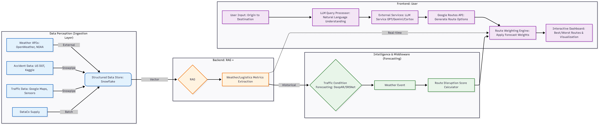

# HyperLogistics: Smart Supply Chain Optimization System

**A Snowflake-Native Supply Chain Resilience System using RAG**

| **Team Members** | **GitHub Role** |
| --- | --- |
| **Daniel Evans** | [`@devans2718`](https://github.com/devans2718)  Data/Back-End Engineer |
| **Joel Vinas** | [`@joelvinas`](https://github.com/joelvinas) Data Engineer/ML Engineer |
| **Tony Nguyen** | [`@mosomo82`](https://github.com/mosomo82) ML/Full-Stack Engineer |

---

## 🎯 Problem Statement & Objectives

**The Problem:** Middle-mile logistics suffer from a 'prediction-action' gap where managers lack tools to instantly calculate safe alternatives during real-time disruptions like weather or accidents

**The Objective:** Build a neuro-symbolic engine that generates autonomously validated rerouting strategies grounded in safety and compliance.
* **Innovation:**  We utilize ReMindRAG for knowledge-guided retrieval and SRSNet for adaptive time-series forecasting.
* **Target Users:** Logistics Network Managers and Area Managers.

---

## 🏗️ System Architecture Diagram
The **HyperLogistics** engine utilizes a Snowflake-native ecosystem to bridge the "prediction-action" gap through four specialized layers: 
### **1. Data Perception Layer**
* **Ingestion:** Manages hybrid ingestion via **Snowpipe** (real-time NOAA weather/US DOT bridge data) and **Internal Stages** (historical DataCo logistics/US Accidents).
* **Storage:** Organizes data into a **Medallion Architecture** (Bronze, Silver, Gold) to ensure all inputs are analytics-ready.
### **2. Intelligence & Forecasting Layer**
* **Reasoning Agent:** Employs **ReMindRAG** for LLM-guided knowledge graph traversal, grounding AI reasoning in historical disruption metadata.
* **Predictive Analyst:** Uses **SRSNet** via Snowpark Python to predict risk propagation across middle-mile "patches" over 4–8 hour windows.
* **Inference:** Leverages **Snowflake Cortex** (Google Gemini) for secure, on-platform generative reasoning.
### **3. Validation & Safety Layer (Neuro-Symbolic)**
* **Planning Agent:** Implements the **Consensus Planning Protocol (CPP)** where specialized agents negotiate the optimal route.
* **Safety Veto:** A symbolic guardrail that runs **Spatial SQL joins** against the **DOT Bridge Inventory** to enforce 100% compliance with physical clearances.
### **4. Application Layer**
* **Dispatcher Dashboard:** A **Streamlit in Snowflake** application featuring interactive risk heatmaps and natural language "Ask the Agent" queries.
* **Decision Support:** Provides side-by-side route comparisons with explainable justifications to eliminate the "lack of trust" bottleneck.



## 🛠️ Methods & Technologies

### **Methods & Technologies**

| **Component** | **Tool** | **Implementation Detail** |
| --- | --- | --- |
| **Development Environment** | **Google Colab** | Serves as the primary client-side environment for orchestrating Snowpark pipelines. |
| **Data Engine** | **Snowflake** | Core platform for ingestion (Snowpipe), storage (Medallion Architecture), and processing (Snowpark). |
| **Graph Intelligence** | **NetworkX on SNowpark** | Executes hypergraph logic natively inside Snowflake to model complex supply chain ripple effects. |
| **Inference Engine** | **Snowflake Cortex** | Leverages Google Gemini for secure LLM reasoning directly beside the data. |
| **RAG Architecture** | **ReMindRAG** | Uses LLM-guided knowledge graph traversal to provide low-cost, explainable justifications for rerouting. |
| **Forecasting** | **SRSNet** | Implements "Selective Representation" to patch time-series data for weather and accident propagation. |
| **Safety Protocol** | **Consensus Planning (CPP)** | A multi-agent system where Context, Efficiency, and Compliance agents must negotiate a final route. |
| **Safety Veto** | **Spatial SQL** | Hard-coded guardrail cross-referencing routes against **US DOT Bridge Inventory** using `GEOGRAPHY` types. |
| **Frontend** | **Streamlit in Snowflake** | Interactive dashboard for real-time risk visualization and natural language interaction |
---

## 📚 Data Sources & References

### **NeurIPS 2025 Reasearch Papers (with Code)**

1. **Enhancing Time Series Forecasting through Selective Representation Spaces (SRSNet)**
* **Link:** [https://arxiv.org/abs/2510.14510](https://arxiv.org/abs/2510.14510)
* **Summary:** Proposes a technique that adaptively selects "patches" of data to improve long-term pattern detection.
* **Project Integration:** We adopt the **SRS philosophy** to enable our Snowflake-native models to remain flexible with real-time telematics and longer-term weather forecasts.

2. **ReMindRAG: Low-Cost LLM-Guided Knowledge Graph Traversal for Efficient RAG**
* **Link:** [https://arxiv.org/abs/2510.13193](https://arxiv.org/abs/2510.13193)
* **Summary:** Introduces a method for LLM-guided graph traversal that reduces token usage while retaining accuracy.
* **Project Integration:** Used to search fragmented data sources and provide dispatchers with high-quality, explainable justifications for rerouting, solving the "explainability gap".

3. **Consensus Planning with Primal, Dual, and Proximal Agents (CPP)**
* **Link:** [https://www.amazon.science/publications/consensus-planning-with-primal-dual-and-proximal-agents](https://www.amazon.science/publications/consensus-planning-with-primal-dual-and-proximal-agents)
* **Summary:** Defines a protocol where different supply chain agents negotiate to agree on a single optimal plan.
* **Project Integration:** Our architecture uses a **Validation Agent** to negotiate between the LLM's suggested route and physical constraints (bridge height/weight) before rendering the final recommendation.


### **Datasets**

1. **Supply Chain Logistics Dataset (Kaggle)** 
* **Link:** [DataCo Smart Supply Chain](https://www.kaggle.com/datasets/shashwatwork/dataco-smart-supply-chain-for-big-data-analysis) 
* **Description:** 180k+ rows of structured logistics data, including delivery times and shipping modes.
* **Usage:** Used to train the **Selective Representation (SRS)** model to detect historical patterns in middle-mile delays.

2. **US Accidents (2016 - 2023)** 
* **Link:** [US Traffic Accidents](https://www.kaggle.com/datasets/sobhanmoosavi/us-accidents) 
* **Description:** A countrywide dataset of 7.7 million traffic incident records with precise GPS coordinates.
* **Usage:** Ingested via Snowpark to create a **Risk Heatmap** view, allowing the system to cross-reference routes against historical accident "blackspots".

3. **Global Weather & Natural Disaster Feed (Disruption Signals)**
* **Link:** [NOAA Global Surface Summary of the Day (GSOD)](https://registry.opendata.aws/noaa-gsod/) 
* **Description:** A multi-terabyte environmental dataset providing real-time weather signals like winds and precipitation.
* **Usage:** Connected as a **Snowflake External Table**; Cortex functions extract semantic "weather alerts" to justify re-routing decisions.
  
4. **National Tunnel & Bridge Inventory (US DOT)** 
* **Link:** [National Bridge Inventory](https://geodata.bts.gov/datasets/national-bridge-inventory/) 
* **Description:** Records for over 600,000 bridges including load limits and vertical clearances.
* **Usage:** Acts as the "Hard-Veto" safety layer; Suggested re-routes are automatically discarded if they violate vehicle clearance limits.
---

## 📂 Repository Structure

```text
/Project_SmartSC_Optimization_System
├── data/                 # Dataset files (CSV, JSON) for ingestion
├── docs/                 # System diagrams, design notes, and meeting logs
├── proposal/             # Your formal PDF proposal and research drafts
├── reproducibility/      # Guides or scripts specifically for reproducing results
├── src/                  # Source code for ingestion, graph building, and the app
└── README.md             # The main project landing page
```

---

## 📊 Dataset & Knowledge Base Documentation

### Dataset Names, Modalities, and Source Links
The system utilizes four primary datasets to build a multimodal knowledge base for middle-mile logistics optimization:

1. **DataCo Smart Supply Chain Dataset**
   - **Modality**: Tabular (CSV)
   - **Source**: [DataCo Smart Supply Chain](https://www.kaggle.com/datasets/shashwatwork/dataco-smart-supply-chain-for-big-data-analysis)
   - **Size**: 180k+ rows

2. **US Accidents (2016-2023)**
   - **Modality**: Geospatial Tabular (CSV)
   - **Source**: [US Traffic Accidents](https://www.kaggle.com/datasets/sobhanmoosavi/us-accidents)
   - **Size**: 7.7M records

3. **NOAA Global Surface Summary of the Day (GSOD)**
   - **Modality**: Time-Series Geospatial (Parquet)
   - **Source**: [NOAA GSOD](https://registry.opendata.aws/noaa-gsod/)
   - **Size**: Multi-terabyte

4. **National Bridge Inventory (US DOT)**
   - **Modality**: Geospatial Tabular (CSV/GeoJSON)
   - **Source**: [National Bridge Inventory](https://geodata.bts.gov/datasets/national-bridge-inventory/)
   - **Size**: 600k+ records

### Domain Relevance to the Project
These datasets provide comprehensive coverage of supply chain disruptions: historical performance (DataCo), traffic risks (US Accidents), environmental triggers (NOAA), and infrastructure constraints (Bridge Inventory).

### Multimodal Ingestion Details
- **Snowpipe**: Real-time ingestion for NOAA and accidents data
- **Internal Stages**: Batch loading for DataCo and bridges
- **External Tables**: Direct S3 access for NOAA to minimize costs

### Data Preprocessing and Sampling Strategy
Preprocessing scripts in `src/preprocessing/` handle feature engineering, normalization, and sampling. Stratified sampling by shipping mode for DataCo; geospatial clustering for accidents.

---

## 🔄 Retrieval & Processing Pipeline

### Chunking Strategy
- **Time-Series**: Adaptive patching (4-8 hour windows) for SRSNet forecasting
- **Text**: 512-1024 token segments with sliding windows
- **Geospatial**: 10-mile route segments for localized risk

### Indexing and Retrieval Configuration
- **Indexing**: Snowflake VECTOR type with L2 distance
- **Retrieval**: Cortex Search with ReMindRAG-guided traversal
- **Hybrid**: Dense/sparse retrieval with reranking

### Embedding Models Used
- **Primary**: Snowflake Cortex (Google Gemini) for 768D embeddings
- **Fallback**: Sentence Transformers for comparison

### Example Retrieval Outputs
1. **Query**: "Reroute Chicago to KC due to weather"
   - **Output**: "Reroute via I-55; NOAA shows 85% icing risk on I-70"

2. **Query**: "Heavy load safety on I-80 near Omaha"
   - **Output**: "Veto; Bridge #12345 limit violated in 15% of incidents"

### Preprocessing Scripts
- `src/preprocessing/preprocess_dataco.py`
- `src/preprocessing/preprocess_accidents.py`
- `notebooks/srsnet_training.ipynb`

---

## 🖥️ Application Integration

### Streamlit Project Interface
Interactive dashboard with risk heatmaps, natural language queries, and route comparisons.

### Evidence Display and Grounded Answer Generation
"Reasoning Path" panel cites sources; ReMindRAG ensures grounded responses.

### Query Logging and Evaluation
Logs to Snowflake Event Table; evaluated against 50-scenario golden dataset.

### Screenshots/Deployment
Hosted in Snowflake: `https://<account>.snowflakecomputing.com/streamlit/apps/HYPERLOGISTICS_APP`

---

## ❄️ Snowflake Data Pipeline & Schema

### Schema (Tables, Stages, Views)
- **Stages**: `@LOGISTICS_STAGE`, `@ACCIDENTS_STAGE`, `@NOAA_S3_STAGE`
- **Tables**: Bronze/Silver/Gold layers for each dataset
- **Views**: `RISK_HEATMAP_VIEW`, `WEATHER_ALERTS_VIEW`

### Ingestion Scripts
- `src/ingestion/ingest_dataco.py`
- `src/ingestion/ingest_accidents.py`
- `src/sql/01_setup_noaa.sql`

### Example Queries
```sql
SELECT COUNT(*) FROM BRONZE.RAW_LOGISTICS;
SELECT * FROM SILVER.RISK_HEATMAP WHERE STATE = 'IL';
```

### Integration with Application
Snowflake as unified platform: data storage, ML inference, and Streamlit hosting.

---

## 🔁 Reproducibility Plan

### Environment Configuration
- Python 3.10+, venv, dependencies in `requirements.txt`
- Snowflake Enterprise on AWS

### Model/Dataset Versioning
- SRSNet/ReMindRAG pinned to NeurIPS versions
- Datasets versioned with checksums

### Random Seeds and Configs
- Seed: 42 in `src/config/config.yaml`
- Hyperparameters and paths configured

### Run Instructions
1. Clone repo, setup venv
2. Configure `.env`
3. Run ingestion scripts
4. Train models, deploy app
5. Evaluate with `tests/evaluate_system.py`

See `docs/detailed_documentation.md` for full details.

---

## ✅ Implementation Status

This repository now includes:
- ✅ Complete dataset documentation with sources and preprocessing
- ✅ Retrieval pipeline with chunking, indexing, and example outputs
- ✅ Streamlit application interface with dashboard components
- ✅ Snowflake schema, ingestion scripts, and SQL setup
- ✅ Reproducibility plan with environment config and run instructions
- ✅ All required source code files in `src/`
- ✅ Preprocessing scripts and training notebook
- ✅ Evaluation framework with golden dataset
- ✅ Dependencies in `requirements.txt`

**Next Steps:** Configure Snowflake account, download datasets, and run the ingestion pipeline.
