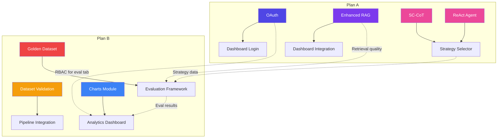

# 🚀 HyperLogistics — Extension Implementation Plans

**Project:** CS5542 Smart Supply Chain Optimization System  
**Date:** February 27, 2026  
**Team:** Tony Nguyen, Daniel Evans, Joel Vinas (3-person team, 2 plans)

---

> [!IMPORTANT]
> Each plan is self-contained and can be worked on in parallel. Cross-plan dependencies are noted where they exist.

---

## 📋 Plan Overview

| Plan | Focus Areas | Key Deliverables | Est. Effort |
|------|-------------|-------------------|-------------|
| **Plan A** | OAuth Authorization, Enhanced RAG, Advanced Prompting | Secure auth layer, ReMindRAG v2, ReAct + SC-CoT agents | ~40 hrs |
| **Plan B** | Evaluation Metrics, Dataset Validation, Graphs & Visualization | Comprehensive eval suite, data integrity checks, interactive charts | ~40 hrs |

---

# 🅰️ Plan A: OAuth + Enhanced RAG + Advanced Prompting

**Assigned to:**


---

## Phase A1: OAuth Authorization (Snowflake + Streamlit)

### Step 1 — Create OAuth Configuration Module
**File:** `src/auth/oauth_config.py`  
**Effort:** 3 hours

1. Create `src/auth/` directory with [__init__.py](file:///c:/Users/mtuan/OneDrive/Documents/GitHub/CS5542_SmartSC_Optimization_System/src/utils/__init__.py)
2. Define an OAuth config class that reads from [.env](file:///c:/Users/mtuan/OneDrive/Documents/GitHub/CS5542_SmartSC_Optimization_System/.env):
   ```python
   # New environment variables to add to .env.template
   SNOWFLAKE_OAUTH_CLIENT_ID="<your-oauth-client-id>"
   SNOWFLAKE_OAUTH_CLIENT_SECRET="<your-oauth-client-secret>"
   SNOWFLAKE_OAUTH_REDIRECT_URI="http://localhost:8501/callback"
   SNOWFLAKE_OAUTH_SCOPE="session:role:SYSADMIN"
   ```
3. Implement token storage (in-memory + optional encrypted file cache)
4. Support both **Authorization Code** flow (for Streamlit web) and **Client Credentials** flow (for pipeline scripts)

**Acceptance Criteria:**
- [ ] OAuth config loads from [.env](file:///c:/Users/mtuan/OneDrive/Documents/GitHub/CS5542_SmartSC_Optimization_System/.env) without errors
- [ ] Missing OAuth vars fall back to password auth gracefully
- [ ] Token refresh logic handles expiry

---

### Step 2 — Implement Snowflake OAuth Session Builder
**File:** [src/utils/snowflake_conn.py](file:///c:/Users/mtuan/OneDrive/Documents/GitHub/CS5542_SmartSC_Optimization_System/src/utils/snowflake_conn.py) (modify existing)  
**Effort:** 3 hours

1. Add a third authentication path to [get_session()](file:///c:/Users/mtuan/OneDrive/Documents/GitHub/CS5542_SmartSC_Optimization_System/src/utils/snowflake_conn.py#L51-L159):
   ```python
   # Authentication priority:
   # 1. OAuth token (if SNOWFLAKE_OAUTH_CLIENT_ID is set)
   # 2. Private key (if SNOWFLAKE_PRIVATE_KEY_PATH is set)
   # 3. Password (if SNOWFLAKE_PASSWORD is set)
   ```
2. Use Snowflake's `authenticator='oauth'` parameter with the access token
3. Implement automatic token refresh using `requests_oauthlib`
4. Add session validation with retry logic

**Key Code Changes:**
```python
# In get_session(), add before the private_key check:
oauth_client_id = os.getenv('SNOWFLAKE_OAUTH_CLIENT_ID')
if oauth_client_id:
    from src.auth.oauth_config import get_oauth_token
    access_token = get_oauth_token()
    connection_params['authenticator'] = 'oauth'
    connection_params['token'] = access_token
    print("Using OAuth authentication")
```

**Acceptance Criteria:**
- [ ] OAuth session connects to Snowflake successfully
- [ ] Falls back to key-pair/password if OAuth not configured
- [ ] Token auto-refreshes before expiry

---

### Step 3 — Add Streamlit Login UI
**File:** [src/app/dashboard.py](file:///c:/Users/mtuan/OneDrive/Documents/GitHub/CS5542_SmartSC_Optimization_System/src/app/dashboard.py) (modify existing)  
**Effort:** 3 hours

1. Add a login gate before the main dashboard renders:
   ```python
   if 'authenticated' not in st.session_state:
       show_login_page()
       st.stop()
   ```
2. Implement `show_login_page()` with:
   - OAuth "Sign in with Snowflake" button (redirects to Snowflake OAuth endpoint)
   - Fallback username/password form
   - Session state management (`st.session_state.user`, `st.session_state.role`)
3. Add a logout button to the sidebar
4. Pass the authenticated user to [log_query()](file:///c:/Users/mtuan/OneDrive/Documents/GitHub/CS5542_SmartSC_Optimization_System/src/app/dashboard.py#31-54) instead of reading from [.env](file:///c:/Users/mtuan/OneDrive/Documents/GitHub/CS5542_SmartSC_Optimization_System/.env)

**Acceptance Criteria:**
- [ ] Unauthenticated users see only the login page
- [ ] OAuth redirect flow works in browser
- [ ] User identity is logged in `GOLD.QUERY_LOGS`
- [ ] Logout clears session and redirects to login

---

### Step 4 — Role-Based Access Control (RBAC)
**File:** `src/auth/rbac.py`  
**Effort:** 2 hours

1. Define role permissions:
   ```python
   ROLE_PERMISSIONS = {
       "ADMIN": ["view_all", "query_agent", "view_logs", "manage_users"],
       "DISPATCHER": ["view_all", "query_agent"],
       "VIEWER": ["view_heatmap", "view_routes"]
   }
   ```
2. Create decorator `@require_role("DISPATCHER")` for tab content
3. Hide unauthorized tabs in the dashboard based on role
4. Log role-based access attempts

**Acceptance Criteria:**
- [ ] Roles correctly control tab visibility
- [ ] Unauthorized access is blocked with friendly message
- [ ] Role is recorded in query logs

---

## Phase A2: Enhanced RAG (ReMindRAG v2)

### Step 5 — Implement Knowledge Graph Builder
**File:** `src/rag/knowledge_graph.py` (new)  
**Effort:** 4 hours

1. Create `src/rag/` directory with [__init__.py](file:///c:/Users/mtuan/OneDrive/Documents/GitHub/CS5542_SmartSC_Optimization_System/src/utils/__init__.py)
2. Build a **NetworkX-based knowledge graph** from Silver-layer tables:
   ```python
   def build_knowledge_graph(session) -> nx.DiGraph:
       """
       Constructs a knowledge graph with:
       - Nodes: Routes, Cities, Bridges, Weather Stations, Drivers, Trucks
       - Edges: route_passes_through, bridge_on_route, weather_affects,
                driver_assigned_to, truck_on_trip
       """
   ```
3. Populate edges from:
   - `SILVER.RISK_HEATMAP_VIEW` → City-Route risk relationships
   - `SILVER.BRIDGE_INVENTORY_GEO` → Bridge-Route constraint relationships
   - `SILVER.LOGISTICS_VECTORIZED` → Operational entity relationships
4. Serialize graph to Snowflake stage for persistence

**Acceptance Criteria:**
- [ ] Graph has ≥ 1,000 nodes and ≥ 3,000 edges
- [ ] Graph can be loaded from Snowflake stage
- [ ] Each node has metadata attributes (type, risk_score, etc.)

---

### Step 6 — LLM-Guided Graph Traversal (Core ReMindRAG)
**File:** `src/rag/remind_rag.py` (new)  
**Effort:** 5 hours

1. Implement the **ReMindRAG traversal algorithm**:
   ```python
   class ReMindRAGRetriever:
       def __init__(self, graph: nx.DiGraph, session, max_hops=3):
           self.graph = graph
           self.session = session
           self.max_hops = max_hops

       def retrieve(self, query: str, top_k: int = 5) -> List[RetrievedContext]:
           # Step 1: Identify seed nodes via embedding similarity
           seed_nodes = self._find_seed_nodes(query)

           # Step 2: LLM-guided expansion (ask Cortex which neighbors to explore)
           expanded = self._llm_guided_traverse(query, seed_nodes)

           # Step 3: Score and rank retrieved contexts
           ranked = self._rank_contexts(query, expanded)

           return ranked[:top_k]
   ```
2. The LLM-guided traversal asks Cortex:
   > "Given the query '{query}' and current node '{node_label}' with neighbors {neighbor_list}, which neighbors should I explore next? Return only the relevant neighbor names."
3. Implement **context window management** — track token budget
4. Add **path explanation** — return the traversal path as the "reasoning chain"

**Acceptance Criteria:**
- [ ] Retriever returns top-k contexts with source attribution
- [ ] Each result includes the traversal path (explainable)
- [ ] Token usage is ≤ 2x compared to naive retrieval
- [ ] Handles queries about routes, weather, bridges, and logistics

---

### Step 7 — Hybrid Retrieval with Dense + Sparse + Graph
**File:** `src/rag/hybrid_retriever.py` (new)  
**Effort:** 3 hours

1. Combine three retrieval strategies:
   ```python
   class HybridRetriever:
       def retrieve(self, query: str) -> List[RetrievedContext]:
           # Dense: Cortex vector similarity on LOGISTICS_VECTORIZED
           dense_results = self._dense_retrieval(query)

           # Sparse: BM25-style keyword matching on TEXT_CONTENT
           sparse_results = self._sparse_retrieval(query)

           # Graph: ReMindRAG traversal
           graph_results = self.remind_rag.retrieve(query)

           # Reciprocal Rank Fusion
           return self._rrf_merge(dense_results, sparse_results, graph_results)
   ```
2. Implement **Reciprocal Rank Fusion (RRF)** scoring:
   ```
   RRF_score(d) = Σ 1/(k + rank_i(d))  for each retrieval method i
   ```
3. Make retrieval weights configurable in [config.yaml](file:///c:/Users/mtuan/OneDrive/Documents/GitHub/CS5542_SmartSC_Optimization_System/src/config/config.yaml)

**Acceptance Criteria:**
- [ ] Hybrid results outperform any single method alone (measured in Phase B eval)
- [ ] Weights are tunable without code changes
- [ ] All results include source attribution

---

### Step 8 — Integrate Enhanced RAG into Dashboard
**File:** [src/app/dashboard.py](file:///c:/Users/mtuan/OneDrive/Documents/GitHub/CS5542_SmartSC_Optimization_System/src/app/dashboard.py) (modify [get_evidence()](file:///c:/Users/mtuan/OneDrive/Documents/GitHub/CS5542_SmartSC_Optimization_System/src/app/dashboard.py#L58-L111))  
**Effort:** 3 hours

1. Replace the current hardcoded SQL evidence retrieval with the `HybridRetriever`:
   ```python
   from src.rag.hybrid_retriever import HybridRetriever

   @st.cache_resource
   def init_retriever():
       return HybridRetriever(session)

   def get_evidence(user_query):
       retriever = init_retriever()
       results = retriever.retrieve(user_query, top_k=5)
       # Format results for display
       evidence = {}
       grounding_sources = []
       for r in results:
           evidence[r.source_type] = r.content
           grounding_sources.append(r.source_table)
       return evidence, grounding_sources
   ```
2. Add a **"Reasoning Path" expander** in the Evidence tab showing the graph traversal
3. Display retrieval method breakdown (which results came from dense/sparse/graph)

**Acceptance Criteria:**
- [ ] Dashboard queries use hybrid retrieval
- [ ] Reasoning path is visible to users
- [ ] Response quality improves (verified by evaluation)

---

## Phase A3: Advanced Prompting Techniques

### Step 9 — Self-Consistency Chain of Thought (SC-CoT)
**File:** `src/prompting/sc_cot.py` (new)  
**Effort:** 4 hours

1. Create `src/prompting/` directory with [__init__.py](file:///c:/Users/mtuan/OneDrive/Documents/GitHub/CS5542_SmartSC_Optimization_System/src/utils/__init__.py)
2. Implement SC-CoT prompting:
   ```python
   class SelfConsistencyCoT:
       def __init__(self, session, num_samples=5, temperature=0.7):
           self.session = session
           self.num_samples = num_samples
           self.temperature = temperature

       def generate(self, query: str, evidence: str) -> SCCoTResult:
           # Step 1: Generate N reasoning chains with temperature sampling
           chains = []
           for i in range(self.num_samples):
               prompt = f"""
               Think step by step about this logistics query.

               Evidence: {evidence}
               Query: {query}

               Step 1: Identify the key factors...
               Step 2: Analyze the risk data...
               Step 3: Consider bridge constraints...
               Step 4: Recommend an action...

               Final Answer:
               """
               response = self._call_cortex(prompt, temp=self.temperature)
               chains.append(self._parse_chain(response))

           # Step 2: Extract final answers and find majority vote
           final_answer = self._majority_vote(chains)

           # Step 3: Return answer with confidence score
           return SCCoTResult(
               answer=final_answer,
               confidence=self._compute_confidence(chains),
               reasoning_chains=chains
           )
   ```
3. Implement **majority voting** across the N generated chains
4. Compute **confidence score** = (votes for winner) / N
5. Return all chains for transparency

**Acceptance Criteria:**
- [ ] Generates N diverse reasoning chains (N configurable)
- [ ] Majority vote produces consistent answers
- [ ] Confidence score > 0.6 for clear-cut scenarios
- [ ] All chains are logged for evaluation

---

### Step 10 — ReAct Agent (Reasoning + Acting)
**File:** `src/prompting/react_agent.py` (new)  
**Effort:** 5 hours

1. Implement the ReAct loop:
   ```python
   class ReActAgent:
       TOOLS = {
           "check_weather": "Query SILVER.WEATHER_ALERTS for conditions",
           "check_accidents": "Query SILVER.RISK_HEATMAP_VIEW for risk zones",
           "check_bridges": "Query SILVER.BRIDGE_INVENTORY_GEO for clearance",
           "check_logistics": "Query SILVER.LOGISTICS_VECTORIZED for ops data",
           "search_graph": "Traverse the knowledge graph for related entities",
       }

       def run(self, query: str, max_steps: int = 5) -> ReActResult:
           history = []
           for step in range(max_steps):
               # THOUGHT: Ask LLM what to do next
               thought = self._think(query, history)

               # ACTION: Execute the chosen tool
               action, action_input = self._parse_action(thought)
               if action == "FINISH":
                   return self._finalize(history)

               observation = self._execute_tool(action, action_input)
               history.append(Step(thought, action, observation))

           return self._finalize(history)
   ```
2. Define **5 tools** the agent can call (each wraps a Snowflake SQL query):
   - `check_weather(region)` → Weather alerts for a region
   - `check_accidents(corridor)` → Accident risk for a corridor
   - `check_bridges(route, vehicle_height, vehicle_weight)` → Bridge compliance
   - `check_logistics(load_id)` → Operational data lookup
   - `search_graph(entity)` → Knowledge graph traversal
3. Implement the **Thought → Action → Observation** loop with Cortex
4. Add **step limit** and **token budget** safeguards
5. Return full trace for the reasoning path display

**ReAct Prompt Template:**
```
You are a logistics routing agent. You have access to these tools:
{tool_descriptions}

Use this format:
Thought: I need to check...
Action: check_weather
Action Input: {"region": "I-70 corridor"}
Observation: [result from tool]
... (repeat)
Thought: I now have enough information.
Action: FINISH
Final Answer: Based on my analysis...
```

**Acceptance Criteria:**
- [ ] Agent correctly selects tools based on query type
- [ ] Multi-step reasoning produces better answers than single-shot
- [ ] Step trace is human-readable
- [ ] Handles "no relevant data" gracefully
- [ ] Stays within token budget

---

### Step 11 — Integrate Prompting Strategies into Dashboard
**File:** [src/app/dashboard.py](file:///c:/Users/mtuan/OneDrive/Documents/GitHub/CS5542_SmartSC_Optimization_System/src/app/dashboard.py) (modify [get_cortex_response()](file:///c:/Users/mtuan/OneDrive/Documents/GitHub/CS5542_SmartSC_Optimization_System/src/app/dashboard.py#L116-L138))  
**Effort:** 3 hours

1. Add a **strategy selector** to the sidebar:
   ```python
   strategy = st.sidebar.selectbox(
       "AI Reasoning Strategy",
       ["Standard", "Chain of Thought (SC-CoT)", "ReAct Agent"],
       help="SC-CoT: Multiple reasoning chains with majority vote. ReAct: Step-by-step tool use."
   )
   ```
2. Route queries to the appropriate strategy:
   ```python
   if strategy == "Chain of Thought (SC-CoT)":
       result = sc_cot.generate(query, evidence_context)
       response = result.answer
       st.sidebar.metric("Confidence", f"{result.confidence:.0%}")
   elif strategy == "ReAct Agent":
       result = react_agent.run(query)
       response = result.final_answer
       # Show step trace
       with st.expander("🔍 ReAct Reasoning Trace"):
           for step in result.steps:
               st.markdown(f"**Thought:** {step.thought}")
               st.markdown(f"**Action:** `{step.action}`")
               st.markdown(f"**Observation:** {step.observation}")
   ```
3. Log which strategy was used in `GOLD.QUERY_LOGS`

**Acceptance Criteria:**
- [ ] All three strategies selectable from UI
- [ ] SC-CoT shows confidence score
- [ ] ReAct shows full reasoning trace
- [ ] Strategy is logged for evaluation comparison

---

### Step 12 — Update Requirements & Config
**Files:** [requirements.txt](file:///c:/Users/mtuan/OneDrive/Documents/GitHub/CS5542_SmartSC_Optimization_System/requirements.txt), [src/config/config.yaml](file:///c:/Users/mtuan/OneDrive/Documents/GitHub/CS5542_SmartSC_Optimization_System/src/config/config.yaml)  
**Effort:** 1 hour

1. Add new dependencies to [requirements.txt](file:///c:/Users/mtuan/OneDrive/Documents/GitHub/CS5542_SmartSC_Optimization_System/requirements.txt):
   ```
   requests-oauthlib>=1.3.0
   ```
2. Add prompting config to [config.yaml](file:///c:/Users/mtuan/OneDrive/Documents/GitHub/CS5542_SmartSC_Optimization_System/src/config/config.yaml):
   ```yaml
   prompting:
     sc_cot:
       num_samples: 5
       temperature: 0.7
     react:
       max_steps: 5
       token_budget: 4096
   rag:
     hybrid_weights:
       dense: 0.4
       sparse: 0.2
       graph: 0.4
     max_hops: 3
     top_k: 5
   ```

---

### 📁 Plan A — New File Summary

| File | Status | Purpose |
|------|--------|---------|
| `src/auth/__init__.py` | New | Auth package init |
| `src/auth/oauth_config.py` | New | OAuth token management |
| `src/auth/rbac.py` | New | Role-based access control |
| `src/rag/__init__.py` | New | RAG package init |
| `src/rag/knowledge_graph.py` | New | NetworkX knowledge graph builder |
| `src/rag/remind_rag.py` | New | ReMindRAG graph traversal retriever |
| `src/rag/hybrid_retriever.py` | New | Dense + Sparse + Graph fusion |
| `src/prompting/__init__.py` | New | Prompting package init |
| `src/prompting/sc_cot.py` | New | Self-Consistency Chain of Thought |
| `src/prompting/react_agent.py` | New | ReAct reasoning agent |
| [src/utils/snowflake_conn.py](file:///c:/Users/mtuan/OneDrive/Documents/GitHub/CS5542_SmartSC_Optimization_System/src/utils/snowflake_conn.py) | Modified | Add OAuth auth path |
| [src/app/dashboard.py](file:///c:/Users/mtuan/OneDrive/Documents/GitHub/CS5542_SmartSC_Optimization_System/src/app/dashboard.py) | Modified | Login gate, strategy selector, enhanced RAG |
| [src/config/config.yaml](file:///c:/Users/mtuan/OneDrive/Documents/GitHub/CS5542_SmartSC_Optimization_System/src/config/config.yaml) | Modified | Add prompting & RAG config |
| [requirements.txt](file:///c:/Users/mtuan/OneDrive/Documents/GitHub/CS5542_SmartSC_Optimization_System/requirements.txt) | Modified | Add `requests-oauthlib` |
| [.env.template](file:///c:/Users/mtuan/OneDrive/Documents/GitHub/CS5542_SmartSC_Optimization_System/.env.template) | Modified | Add OAuth env vars |

---
---

# 🅱️ Plan B: Evaluation Metrics + Dataset Validation + Graphs

**Assigned to:** 


---

## Phase B1: Dataset Validation & Integrity

### Step 1 — Create Data Validation Framework
**File:** `src/validation/data_validator.py` (new)  
**Effort:** 4 hours

1. Create `src/validation/` directory with [__init__.py](file:///c:/Users/mtuan/OneDrive/Documents/GitHub/CS5542_SmartSC_Optimization_System/src/utils/__init__.py)
2. Build a comprehensive validator for each dataset:
   ```python
   class DataValidator:
       def __init__(self, session):
           self.session = session
           self.results = []

       def validate_all(self) -> ValidationReport:
           self.validate_accidents()
           self.validate_bridges()
           self.validate_dataco()
           self.validate_logistics()
           self.validate_weather()
           return ValidationReport(self.results)

       def validate_accidents(self):
           checks = [
               # Schema checks
               self._check_columns("BRONZE.TRAFFIC_INCIDENTS",
                   required=["SEVERITY", "START_LAT", "START_LNG", "STATE", "CITY"]),
               # Data quality checks
               self._check_not_null("BRONZE.TRAFFIC_INCIDENTS", "SEVERITY"),
               self._check_range("BRONZE.TRAFFIC_INCIDENTS", "SEVERITY", 1, 4),
               self._check_range("BRONZE.TRAFFIC_INCIDENTS", "START_LAT", -90, 90),
               self._check_range("BRONZE.TRAFFIC_INCIDENTS", "START_LNG", -180, 180),
               # Row count checks
               self._check_min_rows("BRONZE.TRAFFIC_INCIDENTS", 3_000_000),
               # Freshness checks
               self._check_no_future_dates("BRONZE.TRAFFIC_INCIDENTS", "START_TIME"),
           ]
           self.results.extend(checks)
   ```
3. Implement validation check functions:
   - `_check_columns()` — Verify all required columns exist
   - `_check_not_null()` — NULL percentage below threshold
   - `_check_range()` — Numeric values within valid range
   - `_check_min_rows()` — Minimum row count
   - `_check_no_future_dates()` — No dates in the future
   - `_check_referential_integrity()` — FK relationships hold
   - `_check_duplicates()` — No unexpected duplicate keys
   - `_check_geo_bounds()` — Lat/lon within US boundaries

**Acceptance Criteria:**
- [ ] All 5 datasets have validation checks
- [ ] Each dataset has ≥ 5 distinct checks
- [ ] Report shows PASS/FAIL/WARNING per check
- [ ] Validator can run independently or as part of pipeline

---

### Step 2 — Bronze → Silver Data Quality Checks
**File:** `src/validation/silver_validator.py` (new)  
**Effort:** 3 hours

1. Validate transformations from Bronze to Silver:
   ```python
   class SilverValidator:
       def validate_risk_heatmap(self):
           """Verify SILVER.RISK_HEATMAP_VIEW is correctly aggregated."""
           checks = [
               # Aggregation correctness
               self._check_aggregation_matches_source(
                   source="BRONZE.TRAFFIC_INCIDENTS",
                   target="SILVER.RISK_HEATMAP_VIEW",
                   group_by=["STATE", "CITY"],
                   agg_col="INCIDENT_COUNT",
                   agg_func="COUNT"
               ),
               # No data loss > 5%
               self._check_data_loss_threshold(
                   source="BRONZE.TRAFFIC_INCIDENTS",
                   target="SILVER.RISK_HEATMAP_VIEW",
                   threshold_pct=5
               ),
               # Severity averages are reasonable
               self._check_range("SILVER.RISK_HEATMAP_VIEW", "AVG_SEVERITY", 1.0, 4.0),
           ]
           return checks

       def validate_bridge_geo(self):
           """Verify GEOGRAPHY conversion is valid."""
           checks = [
               # All rows have valid GEOGRAPHY objects
               self._check_not_null("SILVER.BRIDGE_INVENTORY_GEO", "LOCATION"),
               # Spot-check: known bridge coordinates
               self._check_known_bridge("Golden Gate Bridge", lat=37.8199, lon=-122.4783, tolerance_km=1),
           ]
           return checks
   ```

**Acceptance Criteria:**
- [ ] Bronze-to-Silver row count consistency verified
- [ ] Aggregation math is validated
- [ ] Geography conversions produce valid spatial objects
- [ ] Vectorized text chunks are non-empty

---

### Step 3 — Integrate Validation into Pipeline
**File:** [src/run_pipeline.py](file:///c:/Users/mtuan/OneDrive/Documents/GitHub/CS5542_SmartSC_Optimization_System/src/run_pipeline.py) (modify)  
**Effort:** 2 hours

1. Add validation steps after ingestion and preprocessing:
   ```python
   # After Bronze ingestion steps...
   from validation.data_validator import DataValidator
   _step("Validate Bronze Layer", DataValidator(session).validate_all)

   # After Silver preprocessing steps...
   from validation.silver_validator import SilverValidator
   _step("Validate Silver Layer", SilverValidator(session).validate_all)
   ```
2. Save validation report to `GOLD.VALIDATION_REPORTS` table
3. Add `--skip-validation` flag for faster re-runs

**Acceptance Criteria:**
- [ ] Pipeline prints validation summary after each layer
- [ ] Validation failures don't block pipeline (warning level configurable)
- [ ] Reports are persisted in Snowflake

---

### Step 4 — Create Standalone Validation Script
**File:** `tests/validate_datasets.py` (new)  
**Effort:** 2 hours

1. Runnable as: `python tests/validate_datasets.py`
2. Produces a formatted report:
   ```
   ══════════════════════════════════════════════════════
   DATASET VALIDATION REPORT — 2026-02-27 09:35:00
   ══════════════════════════════════════════════════════

   BRONZE.TRAFFIC_INCIDENTS
     ✅ PASS  Required columns present (47/47)
     ✅ PASS  SEVERITY values in range [1, 4]
     ✅ PASS  Row count: 3,213,457 (min: 3,000,000)
     ⚠️ WARN  NULL rate for CITY: 2.3% (threshold: 5%)
     ✅ PASS  Lat/Lon within US bounds

   SILVER.RISK_HEATMAP_VIEW
     ✅ PASS  Aggregation consistent with source
     ✅ PASS  Data loss: 0.1% (threshold: 5%)
     ✅ PASS  AVG_SEVERITY in range [1.0, 4.0]

   SUMMARY: 23/25 checks passed, 2 warnings, 0 failures
   ══════════════════════════════════════════════════════
   ```
3. Exit code 0 for all-pass, 1 for any failure

**Acceptance Criteria:**
- [ ] Runs independently without pipeline
- [ ] Produces human-readable report
- [ ] Can be integrated into CI/CD

---

## Phase B2: Evaluation Metrics

### Step 5 — Expand Golden Dataset
**File:** [data/golden_dataset.json](file:///c:/Users/mtuan/OneDrive/Documents/GitHub/CS5542_SmartSC_Optimization_System/data/golden_dataset.json) (modify)  
**Effort:** 3 hours

1. Expand from current 2 scenarios to **50 scenarios** covering:
   ```json
   {
     "scenario_id": "S001",
     "category": "weather_reroute",
     "query": "Reroute shipment from Chicago to Kansas City due to severe icing on I-70",
     "should_reroute": true,
     "expected_route": "I-55 to I-44 to I-49",
     "expected_evidence_sources": ["NOAA_GSOD", "RISK_HEATMAP"],
     "expected_safety_check": true,
     "difficulty": "medium",
     "tags": ["weather", "reroute", "midwest"]
   }
   ```
2. Cover these scenario categories (10 each):
   - **Weather reroutes** (icing, flooding, visibility)
   - **Bridge constraint violations** (height, weight, condition)
   - **Accident blackspot avoidance** (historical risk zones)
   - **Multi-factor decisions** (weather + bridge + accident combined)
   - **Negative cases** (queries that should NOT trigger reroute)

**Acceptance Criteria:**
- [ ] 50 scenarios total, evenly distributed across categories
- [ ] Each scenario has all required fields
- [ ] Negative cases (should_reroute=false) included

---

### Step 6 — Comprehensive Evaluation Framework
**File:** [tests/evaluate_system.py](file:///c:/Users/mtuan/OneDrive/Documents/GitHub/CS5542_SmartSC_Optimization_System/tests/evaluate_system.py) (rewrite)  
**Effort:** 5 hours

1. Implement a multi-metric evaluation framework:
   ```python
   class SystemEvaluator:
       def evaluate(self, golden_path, predictions_path) -> EvalReport:
           # Classification Metrics
           classification = self._eval_classification(golden, preds)
           # Retrieval Metrics
           retrieval = self._eval_retrieval(golden, preds)
           # Generation Quality Metrics
           generation = self._eval_generation(golden, preds)
           # Latency Metrics
           latency = self._eval_latency(preds)
           return EvalReport(classification, retrieval, generation, latency)
   ```
2. **Classification Metrics** (reroute yes/no decision):
   - Precision, Recall, F1-Score
   - Accuracy
   - Confusion Matrix
   - Per-category breakdown
3. **Retrieval Metrics** (RAG quality):
   - Recall@K (did the correct evidence sources appear in top-K?)
   - Mean Reciprocal Rank (MRR)
   - Normalized Discounted Cumulative Gain (NDCG@5)
   - Source Attribution Accuracy (did the cited sources match expected?)
4. **Generation Quality Metrics**:
   - Groundedness Score (% of claims supported by retrieved evidence)
   - Answer Relevance (cosine similarity of answer embedding vs. expected)
   - Faithfulness (no hallucinated facts)
   - ROUGE-L score vs. expected answer
5. **Latency Metrics**:
   - P50, P90, P99 response times
   - Retrieval time vs. generation time breakdown

**Acceptance Criteria:**
- [ ] All 4 metric categories implemented
- [ ] Per-scenario and aggregate results
- [ ] Results saved to JSON and Snowflake
- [ ] Compares strategies (Standard vs. SC-CoT vs. ReAct) — *depends on Plan A*

---

### Step 7 — Automated Evaluation Runner
**File:** `tests/run_evaluation.py` (new)  
**Effort:** 3 hours

1. End-to-end evaluation pipeline:
   ```python
   def run_full_evaluation():
       # 1. Load golden dataset
       golden = load_golden_dataset("data/golden_dataset.json")

       # 2. Run each scenario through the system
       predictions = []
       for scenario in golden:
           result = run_scenario(session, scenario)
           predictions.append(result)

       # 3. Save predictions
       save_predictions("data/predictions.json", predictions)

       # 4. Evaluate
       evaluator = SystemEvaluator()
       report = evaluator.evaluate(golden, predictions)

       # 5. Generate report
       report.print_summary()
       report.save_to_snowflake(session)
       report.save_to_json("tests/evaluation_results.json")
   ```
2. Run each golden scenario against the live system:
   - Call [get_evidence()](file:///c:/Users/mtuan/OneDrive/Documents/GitHub/CS5542_SmartSC_Optimization_System/src/app/dashboard.py#58-112) → measure retrieval quality
   - Call [get_cortex_response()](file:///c:/Users/mtuan/OneDrive/Documents/GitHub/CS5542_SmartSC_Optimization_System/src/app/dashboard.py#116-139) → measure generation quality
   - Measure end-to-end latency
3. Compare across prompting strategies (if Plan A is complete)

**Acceptance Criteria:**
- [ ] Runs all 50 scenarios automatically
- [ ] Produces machine-readable + human-readable reports
- [ ] Handles Snowflake connection failures gracefully

---

### Step 8 — A/B Comparison Across Strategies
**File:** `tests/compare_strategies.py` (new)  
**Effort:** 2 hours

1. Run the golden dataset against each strategy and compare:
   ```
   ╔════════════════════════════════════════════════════╗
   ║           STRATEGY COMPARISON REPORT               ║
   ╠═════════════════╦══════════╦═════════╦════════════╣
   ║ Metric          ║ Standard ║ SC-CoT  ║ ReAct      ║
   ╠═════════════════╬══════════╬═════════╬════════════╣
   ║ F1 Score        ║ 0.72     ║ 0.81    ║ 0.85       ║
   ║ Groundedness    ║ 0.65     ║ 0.78    ║ 0.91       ║
   ║ MRR             ║ 0.70     ║ 0.70    ║ 0.82       ║
   ║ P50 Latency     ║ 1.2s     ║ 4.8s    ║ 6.1s       ║
   ╚═════════════════╩══════════╩═════════╩════════════╝
   ```
2. Statistical significance testing (paired t-test on per-scenario scores)
3. Output comparison as both table and chart data

**Acceptance Criteria:**
- [ ] Side-by-side comparison across all metrics
- [ ] Statistical significance reported
- [ ] Results feed into the graphs (Phase B3)

---

## Phase B3: Graphs & Visualization

### Step 9 — Create Visualization Module
**File:** `src/visualization/charts.py` (new)  
**Effort:** 4 hours

1. Create `src/visualization/` directory with [__init__.py](file:///c:/Users/mtuan/OneDrive/Documents/GitHub/CS5542_SmartSC_Optimization_System/src/utils/__init__.py)
2. Build chart generators using **Plotly** (interactive) and **Matplotlib** (static):
   ```python
   class ChartGenerator:
       def risk_heatmap_choropleth(self, risk_data: pd.DataFrame) -> go.Figure:
           """US state-level risk choropleth map."""

       def severity_distribution(self, accident_data: pd.DataFrame) -> go.Figure:
           """Histogram of accident severity levels."""

       def weather_alert_timeline(self, alert_data: pd.DataFrame) -> go.Figure:
           """Time-series of weather alerts by type."""

       def bridge_condition_sunburst(self, bridge_data: pd.DataFrame) -> go.Figure:
           """Sunburst chart: State → Condition → Count."""

       def route_risk_comparison(self, routes: List[Route]) -> go.Figure:
           """Side-by-side bar chart comparing route risk factors."""

       def evaluation_radar(self, eval_report: dict) -> go.Figure:
           """Radar/spider chart of evaluation metrics."""

       def strategy_comparison_bars(self, comparison: dict) -> go.Figure:
           """Grouped bar chart: Strategy × Metric."""

       def latency_boxplot(self, latency_data: pd.DataFrame) -> go.Figure:
           """Box plot of response latencies by strategy."""
   ```
3. Add consistent theming:
   ```python
   HYPERLOGISTICS_THEME = {
       "colorway": ["#4F46E5", "#7C3AED", "#EC4899", "#F59E0B", "#10B981"],
       "template": "plotly_dark",
       "font_family": "Inter, sans-serif"
   }
   ```

**Acceptance Criteria:**
- [ ] ≥ 8 distinct chart types implemented
- [ ] All charts use consistent branding
- [ ] Charts are interactive (zoom, hover, filter)
- [ ] Charts work in Streamlit via `st.plotly_chart()`

---

### Step 10 — Add Analytics Dashboard Tab
**File:** [src/app/dashboard.py](file:///c:/Users/mtuan/OneDrive/Documents/GitHub/CS5542_SmartSC_Optimization_System/src/app/dashboard.py) (modify)  
**Effort:** 4 hours

1. Add a new **"📈 Analytics"** tab to the dashboard:
   ```python
   tab1, tab2, tab3, tab4, tab5 = st.tabs([
       "Risk Heatmap",
       "Route Comparison",
       "Evidence & Reasoning",
       "📈 Analytics",
       "Query Logs"
   ])
   ```
2. In the Analytics tab, display:
   ```python
   with tab4:
       st.header("📈 System Analytics & Insights")

       # Row 1: Key Metrics
       col1, col2, col3, col4 = st.columns(4)
       # Total incidents, active alerts, bridges flagged, avg response time

       # Row 2: Charts
       chart_col1, chart_col2 = st.columns(2)
       with chart_col1:
           st.plotly_chart(charts.risk_heatmap_choropleth(risk_data))
       with chart_col2:
           st.plotly_chart(charts.severity_distribution(accident_data))

       # Row 3: Time series
       st.plotly_chart(charts.weather_alert_timeline(alert_data))

       # Row 4: Bridge analysis
       st.plotly_chart(charts.bridge_condition_sunburst(bridge_data))
   ```
3. Add **date range filters** and **state/corridor selectors**
4. Implement **auto-refresh** toggle for real-time monitoring

**Acceptance Criteria:**
- [ ] Analytics tab renders without errors
- [ ] ≥ 4 interactive charts displayed
- [ ] Filters dynamically update all charts
- [ ] Charts load in < 3 seconds

---

### Step 11 — Add Evaluation Dashboard Tab
**File:** [src/app/dashboard.py](file:///c:/Users/mtuan/OneDrive/Documents/GitHub/CS5542_SmartSC_Optimization_System/src/app/dashboard.py) (modify)  
**Effort:** 3 hours

1. Add a **"🧪 Evaluation"** tab (admin-only via RBAC from Plan A):
   ```python
   with tab_eval:
       st.header("🧪 System Evaluation Dashboard")

       # Load latest evaluation results
       eval_data = load_latest_evaluation(session)

       # Radar chart: Overall system performance
       st.plotly_chart(charts.evaluation_radar(eval_data))

       # Strategy comparison (if multiple strategies evaluated)
       st.plotly_chart(charts.strategy_comparison_bars(eval_data))

       # Per-scenario breakdown table
       st.dataframe(eval_data["per_scenario"], use_container_width=True)

       # Latency analysis
       st.plotly_chart(charts.latency_boxplot(eval_data["latencies"]))

       # Confusion matrix heatmap
       st.plotly_chart(charts.confusion_matrix(eval_data))
   ```
2. Add evaluation run trigger button (admin only)
3. Show historical evaluation trends over time

**Acceptance Criteria:**
- [ ] Evaluation results visualized clearly
- [ ] Strategy comparison is intuitive
- [ ] Historical trend tracking works

---

### Step 12 — Update Requirements & Static Assets
**Files:** [requirements.txt](file:///c:/Users/mtuan/OneDrive/Documents/GitHub/CS5542_SmartSC_Optimization_System/requirements.txt), docs  
**Effort:** 1 hour

1. Add to [requirements.txt](file:///c:/Users/mtuan/OneDrive/Documents/GitHub/CS5542_SmartSC_Optimization_System/requirements.txt):
   ```
   plotly>=5.18.0
   rouge-score>=0.1.2
   scikit-learn>=1.3.0
   ```
2. Generate sample charts for documentation
3. Update README.md with new tabs and features

---

### 📁 Plan B — New File Summary

| File | Status | Purpose |
|------|--------|---------|
| `src/validation/__init__.py` | New | Validation package init |
| `src/validation/data_validator.py` | New | Bronze-layer data quality checks |
| `src/validation/silver_validator.py` | New | Silver-layer transformation checks |
| `src/visualization/__init__.py` | New | Visualization package init |
| `src/visualization/charts.py` | New | Plotly + Matplotlib chart generators |
| `tests/validate_datasets.py` | New | Standalone dataset validation script |
| [tests/evaluate_system.py](file:///c:/Users/mtuan/OneDrive/Documents/GitHub/CS5542_SmartSC_Optimization_System/tests/evaluate_system.py) | Rewritten | Comprehensive multi-metric evaluation |
| `tests/run_evaluation.py` | New | Automated evaluation runner |
| `tests/compare_strategies.py` | New | A/B strategy comparison |
| [data/golden_dataset.json](file:///c:/Users/mtuan/OneDrive/Documents/GitHub/CS5542_SmartSC_Optimization_System/data/golden_dataset.json) | Expanded | 2 → 50 evaluation scenarios |
| [src/run_pipeline.py](file:///c:/Users/mtuan/OneDrive/Documents/GitHub/CS5542_SmartSC_Optimization_System/src/run_pipeline.py) | Modified | Add validation steps |
| [src/app/dashboard.py](file:///c:/Users/mtuan/OneDrive/Documents/GitHub/CS5542_SmartSC_Optimization_System/src/app/dashboard.py) | Modified | Add Analytics + Evaluation tabs |
| [requirements.txt](file:///c:/Users/mtuan/OneDrive/Documents/GitHub/CS5542_SmartSC_Optimization_System/requirements.txt) | Modified | Add plotly, rouge-score, scikit-learn |

---

## 🔗 Cross-Plan Dependencies



> [!TIP]
> **Recommended work order:** Both plans can start simultaneously. Plan A's prompting strategies (Steps 9-11) should be ready before Plan B's strategy comparison (Step 8).

---

## ⏱️ Timeline Overview

| Week | Plan A | Plan B |
|------|--------|--------|
| **1** | Steps 1-4 (OAuth) | Steps 1-4 (Dataset Validation) |
| **2** | Steps 5-8 (Enhanced RAG) | Steps 5-7 (Evaluation Metrics) |
| **3** | Steps 9-12 (Prompting + Integration) | Steps 8-12 (Strategy Comparison + Graphs) |
| **4** | Cross-plan integration testing | Cross-plan integration testing |

---

> [!IMPORTANT]
> **Before starting:** Ensure all team members have the latest [.env](file:///c:/Users/mtuan/OneDrive/Documents/GitHub/CS5542_SmartSC_Optimization_System/.env) configuration, a working Snowflake connection, and the datasets loaded in Bronze/Silver layers. Run `python src/verify_pipeline.py` to confirm.
